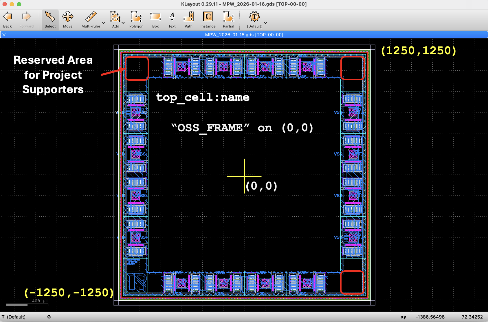
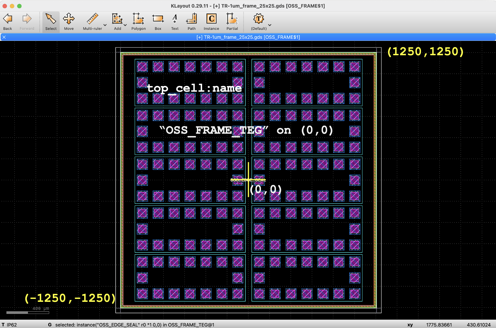
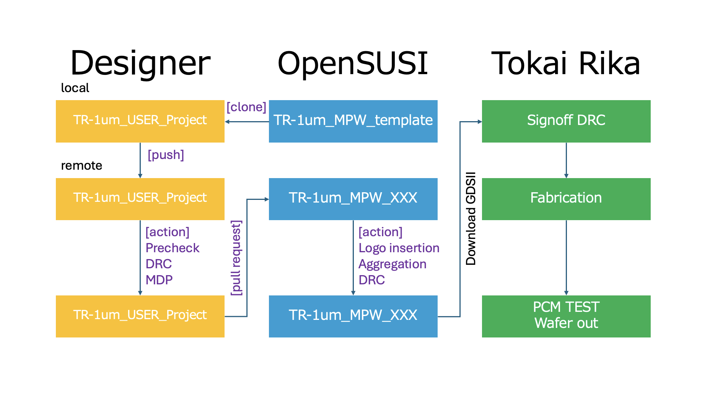

# TR-1um_MPW_template

- [Read the documentation for project](docs/info.md)

# TR-1um_MPW actions

The GitHub CI/CD actions will perform the following steps.

**Pre-check**

The pre-check validates that:

- The top cell name matches the entry in info.yaml (gds.top_cell).

- The top cell name should be unique.

- The top cell database unit (dbu) must be 0.001um.

- The top cell drawing area fits within the range (-1250, -1250) to (1250, 1250).

- The top cell includes one of the OpenSUSI recommended frame cells OSS_FRAME or OSS_FRAME_TEG.
  

**DRC**

The DRC stage performs:

- KLayout DRC(Drawing) checks and Antenna checks.

- Verifies the top cell preserves open space for corner-reserved areas.

**LVS**

The LVS stage performs:

- KLayout LVS with the provided circuit netlist.

- Uploads the extracted netlist for review.

**MDP**

The MDP stage performs the following:

- Generates the IP62 MASK and DLXXX layer GDSII from the TR-1um drawing layers.

- The resulting IP62 GDSII can be downloaded for reference and further verification.

- Runs KLayout DRC(MASK) checks and antenna checks on the generated MDP output.

